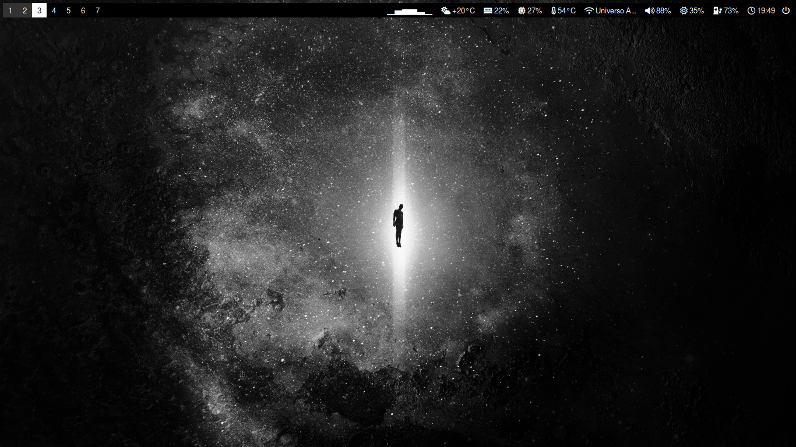
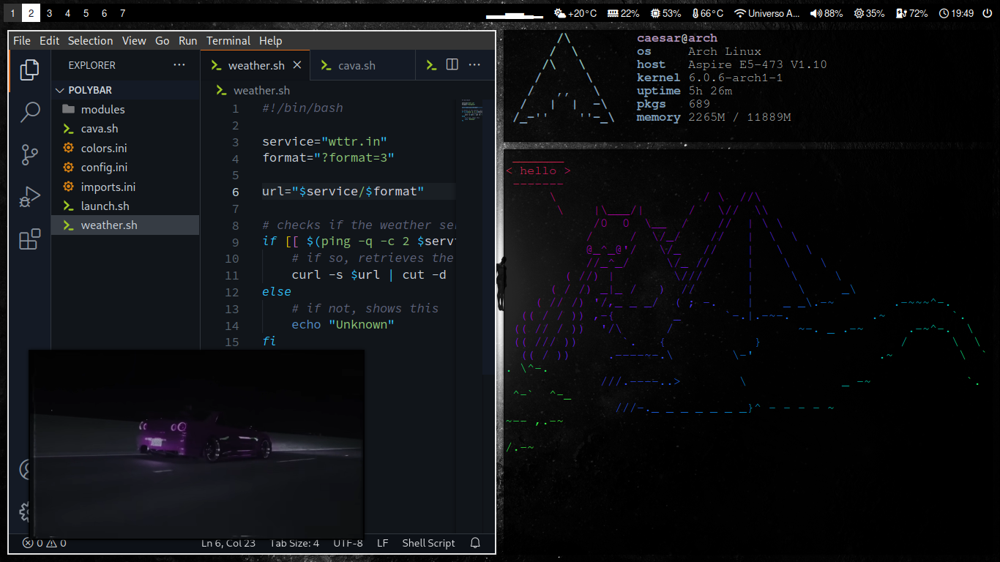
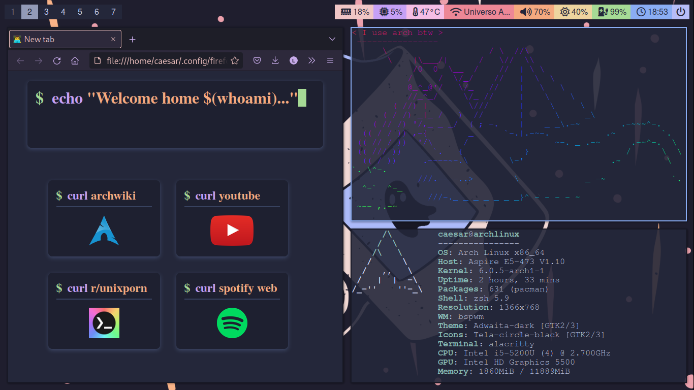
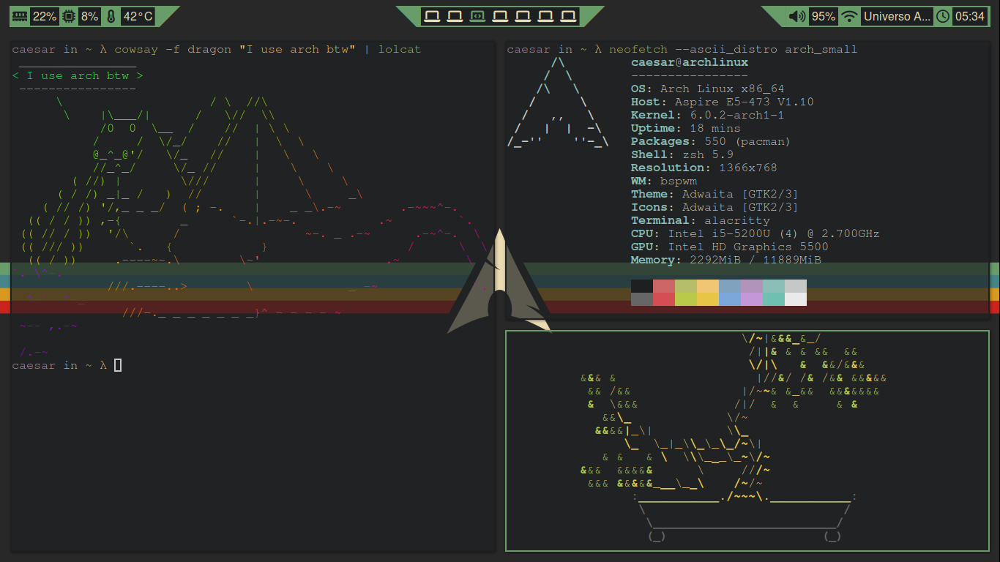
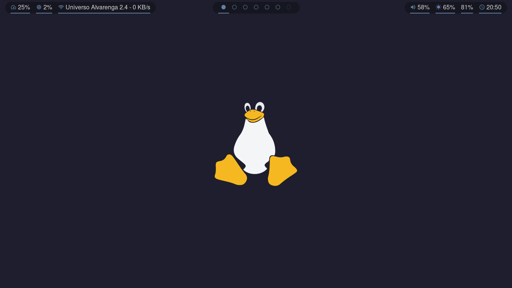
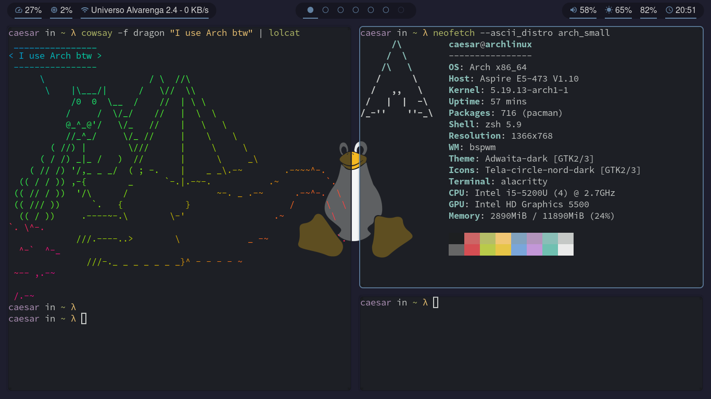

# bspwm

A collection of my bspwm config files for each of my setups based on it.

To use any the setups, follow the steps bellow:

1. Install `xorg-server`,  `xorg-xinit`,  `bspwm`, `sxhkd`, `polybar`, `font awesome ` and an `x` compositor of your liking
2. Copy the contents of the desired setup to `~/.config/bspwm/`
3. Copy the contents of the desired `polybar` setup to `~/.config/polybar/`
4. Copy the contents of the `sxhkd` directory to `~/.config/sxhkd`

### void 🌀

\

### blocky 🐱 - a [catppuccin](https://github.com/catppuccin/catppuccin) setup for bspwm

To enjoy this setup even more, add the `.config/firefox` to your `~/.config` directory and setup its `index.html` as your default start page on Firefox.

### gruv1 - a [gruvbox](https://github.com/morhetz/gruvbox) setup for bspwm

### tuxppuccin 🐧 - a [catppuccin](https://github.com/catppuccin/catppuccin) inspired setup for bspwm

To enjoy this setup even more, add the `.config/firefox` to your `~/.config` directory and setup its `index.html` as your default start page on Firefox.

\

